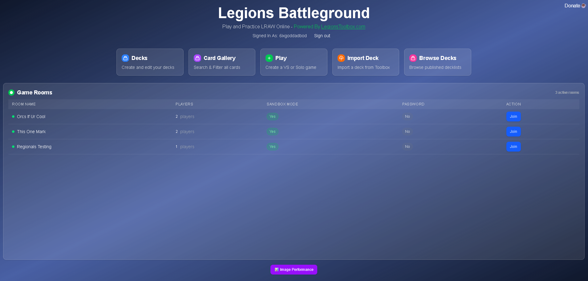
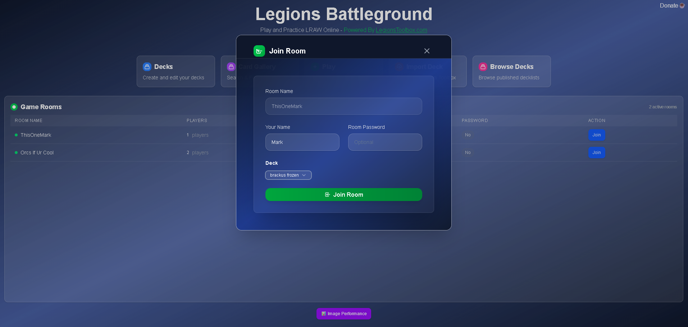
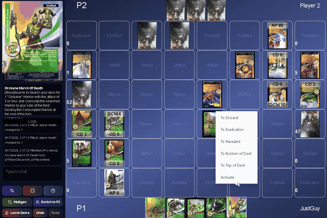
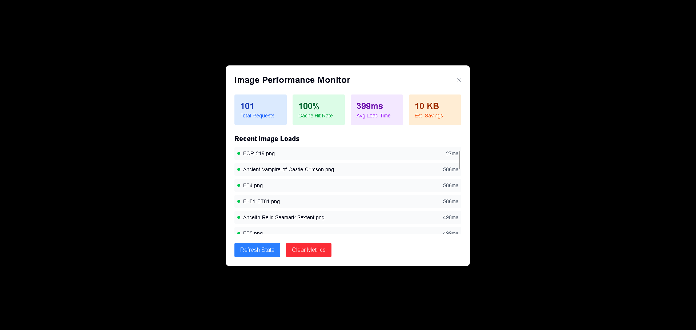

# Legions Battleground

Legions Battleground is a full-stack TypeScript application for playing and practising **Legions: Realms at War** online. It combines a Next.js interface with an Express and Socket.IO server for live multiplayer play, authenticated deck libraries, and a sandbox mode for testing card interactions.

[Live demo](https://legions-battleground.onrender.com) · [Architecture](./docs/architecture.md) · [API reference](./docs/api.md) · [Development guide](./docs/development-guide.md)



## What it does

- Creates and joins password-protected game rooms with live room updates.
- Runs structured and sandbox game modes, including mulligans, turn phases, dice rolls, action points, health, and card-effect sequences.
- Synchronizes game actions and chat in real time with Socket.IO.
- Provides OAuth sign-in through GitHub, Google, and Discord with user-specific deck libraries.
- Imports decks from [LegionsToolbox.com](https://legionstoolbox.com/) and supports deck browsing, editing, duplication, deletion, and publishing.
- Supports drag-and-drop card movement, context menus, modifiers, targeting, cooldowns, and the game zones needed by the ruleset.
- Includes responsive game and deck-building interfaces with card filtering and hover previews.

## Screenshots

### Join a game



### Deck building and gameplay



### Image Performance Monitor



## Architecture at a glance

```text
Next.js App Router + React UI
        │
        ├── NextAuth OAuth and protected routes
        ├── Redux client state
        └── Socket.IO client ───────────────┐
                                             │
Express server + Socket.IO server ───────────┘
        │
        ├── Game, room, card, validation, and API services
        └── MongoDB (cards, decks, rooms, and game state)
```

The frontend and Express server run as one deployable Node.js process. Shared game-state interfaces and enums live in `src/shared/` so client and server use the same domain model. See the [architecture guide](./docs/architecture.md) for service boundaries and state flow.

## Tech stack

- **Frontend:** Next.js 15, React 18, TypeScript, Tailwind CSS, Redux Toolkit, React DnD, Radix UI, and Ant Design.
- **Backend:** Express 5, Socket.IO, MongoDB, and Node.js.
- **Authentication:** NextAuth with GitHub, Google, and Discord OAuth providers.
- **Tooling and deployment:** ESLint, TypeScript, Docker, and Render.

## Run locally

### Prerequisites

- Node.js 20+
- A MongoDB instance
- OAuth credentials for any sign-in providers you want to enable

### Setup

```bash
npm install
cp .env.example .env
```

Fill in `MONGO_URL`, `NEXTAUTH_SECRET`, and any OAuth credentials in `.env`, then start the development server:

```bash
npm run dev
```

The application is available at `http://localhost:3000`.

### Production build

```bash
npm run build
npm start
```

Docker is also supported:

```bash
docker build -t legions-battleground .
docker run -p 3000:3000 legions-battleground
```

## Quality checks

```bash
npm run lint
npm run typecheck
npm run typecheck:server
npm run build
```

These commands respectively lint the project, check client and server TypeScript, and produce the production bundle. The project does not currently include an automated test suite; the [sandbox testing guide](./docs/sandbox-mode.md) documents its manual game-flow checks.

## Documentation

- [Architecture](./docs/architecture.md) — application boundaries, services, shared state, and deployment model.
- [Game engine](./docs/game-engine.md) — game modes, state flow, zones, actions, and sequences.
- [Development guide](./docs/development-guide.md) — conventions for API, service, socket, and database changes.
- [API reference](./docs/api.md) — REST endpoints and Socket.IO events.
- [Image loading](./docs/image-loading.md) — caching, preloading, service worker, and performance monitoring.
- [Sandbox mode](./docs/sandbox-mode.md) — sandbox behavior and manual testing scenarios.
- [Testing and quality](./docs/testing-and-quality.md) — validation commands and current coverage boundaries.
- [Security notes](./docs/security.md) — authentication and security review notes.

## Contributing

1. Fork the repository and create a focused branch.
2. Make the change and update the relevant documentation.
3. Run the quality checks above.
4. Open a pull request with a concise description and verification notes.

## License

This project is licensed under the MIT License.
